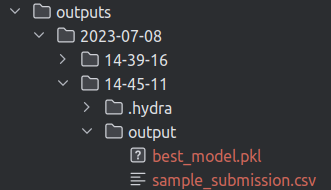
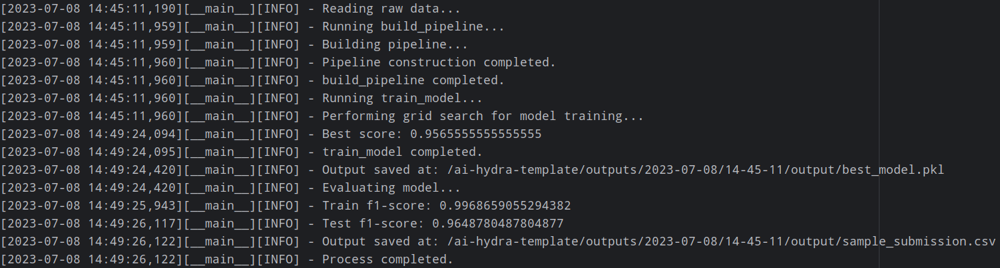

# ai-hydra-template

_ _ _

## Introduction
The **[Hydra](https://habr.com/ru/amp/publications/696820/)** framework is a powerful tool for developing and managing complex machine learning pipelines and experiments. It provides a flexible and modular approach to configuring and organizing AI projects, making it easier to handle various components such as data, models, optimizers, and configurations.

Hydra offers a wide range of features that enhance the development workflow, including:

- **Configuration Management**: Hydra allows you to separate the code from the configuration, making it easier to manage different experiments and variations without modifying the codebase. It provides a hierarchical structure for configurations, allowing you to override specific parameters at different levels.

- **Parameter Sweeping**: With Hydra, you can easily perform parameter sweeps to explore different combinations of hyperparameters for your models. This feature greatly simplifies the process of finding optimal configurations.

- **Plugin System**: Hydra is designed with a modular plugin system that enables easy integration with different libraries and frameworks. You can extend its functionality by adding custom plugins or by using existing ones.

- **Logging and Experiment Tracking**: Hydra integrates well with popular experiment tracking tools like TensorBoard, WandB, and Neptune, allowing you to monitor and analyze your experiments effectively.

- **Reproducibility**: Hydra provides mechanisms for capturing and reproducing experiment setups, making it easier to share and replicate experiments across different environments.

- **Easy Integration**: Hydra can be seamlessly integrated with various machine learning frameworks such as PyTorch, TensorFlow, and scikit-learn, making it suitable for a wide range of AI projects.

The ai-hydra-template repository is a starting point for building AI projects using the Hydra framework. It includes a basic project structure, sample configuration files, and examples to help you get started with Hydra quickly and easily.

- - -
## Insallation requirements

### Python packages

```bash
pip install -r requirements.txt
```

## Usage

```bash
python src/app.py
```

## Example of output


